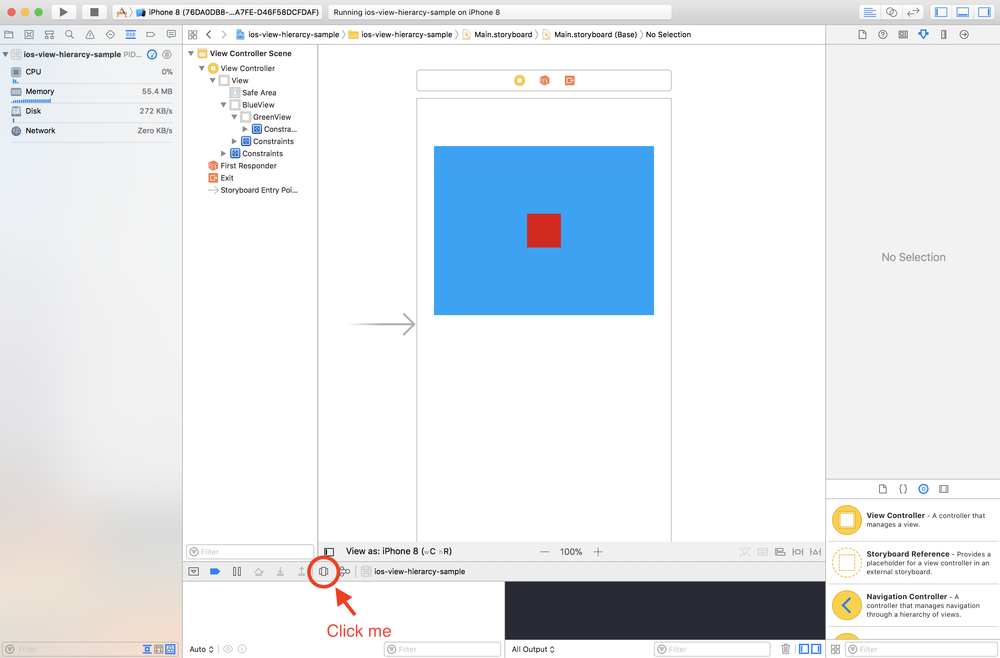

# View Hierarchy

## Topics

By the end of this lesson we will cover:
- the basics of UIViews
- interface objects
- CALayers
- Subviews and Superview
- Creating custom uiviews
- loading Xibs from the bundle
- UIViewControllers
- UIWindows

## UIViews

A view object marks a rectangular area on the screen can that control the drawing of objects. It is responsible for handling and responding to events such as touches and aids other sub components to draw onto a screen(eg iPhone).

Views by themselves aren't very useful, to make use of a UIView, it needs to be added onto a Window( Windows are covered below).

UIViews don't necessarily draw onto the screen but rather provide the infrastructure for drawing onto the screen. Think of UIViews as empty canvases that we can draw unto.

The UIKit framework provides us with some basic UIComponents made out of UIViews(subclasses). Controls like UIButton, UISegmentedControl all inherit from UIView and utilize this to draw themselves onto the screen and handle input from users such as tapping a UIButton.

### Superview & Subviews

UIKit uses a lot of Object Oriented Programming principles. Each UIView subclass can have one **superview** and many **subviews**.

The relationship between _superviews_ and _subviews_ are really important and come in handy when discussing the differences between a View's **frame** and its **bounds**.

### Creating Custom Views
There are 3 different ways of creating custom views; Storyboards, Nib files and Programmatically. We will start with Nib/Xib files as these are the most common way of creating custom views.

### Interface Objects - XIBs, NIBs
Interface objects are used to represent visual and non-visual elements. They can represent views, windows, menus and controls but are also used to represent non-visual elements such as gesture recognizers.

When creating custom views with Xibs, you first create the .swift file that will contain the subclass of UIView which will handle all the interactions with the view. Creating a Xib file next will enable you to design all your user interface elements visually then you can later connect the Xib file to the .swift file.

#### UIView initializers

UIViews can be initialized in two different ways, through its base initializer from frame:

1.
```swift
override init(frame: CGRect) {
        super.init(frame: frame)  
}
```

2.
And/or through its Xib initialer:

```swift
required init?(coder aDecoder: NSCoder) {
    super.init(coder: aDecoder)    
}
```

#### File's Owner
The File's Owner object is unlike other interface objects. It serves as a link between your Interface Object and its connection in code. You can think of it as a controller for your interface object.

*Note*
When you attach a Xib file to a custom UIView, and display the custom view through interface builder, the UIView will be initialized with the 2nd initializer.

#### Activity
#### Q&A

1. Why is the initializer from a Xib initialized with NSCoder?
2. How do we know which initializer will be called when creating a UIView that can be instantiated both programmatically and with Xib files?
3. Why do we setup the Xib files in both initializers?

### Activity
#### Creating a Custom UIView with XIBs

Creating custom UIViews in Xcode isn't the most pleasant experience. Unlike creating custom UIViewControllers, custom UIViews don't automatically 'hook up' to their Xib files to their backing `.swift` files.

Clone the starter repo below:

[Custom UIView with XIBs Starter Project](https://github.com/Product-College-Labs/ios-custom-views.git)

#### Guidelines for creating custom XIBs

- Break down user interfaces to modular XIBs
- Create custom XIB interfaces for frequently used custom components. eg. A custom UIButton

## Storyboards

#### Scene Dock
The scene dock is a interface builder feature that allows you to place user interface elements on top of a scene (UIViewController). This allows you to move interface elements that will be loaded or added at a later point to your scene.

## CALayers

UIViews don't do much other than orchestrate and manage view hierarchy and respond to events. That is where CALayers come in.

Layers are responsible for drawing visual elements onto a view. Every UIView has at least one CALayer object that is backing it.

## UIViewController


## UIWindow
iOS applications start with a Window(UIWindow). It is a special subclass of UIView that is responsible for displaying & managing other views(UIViewControllers). The window can have many UIViews & UIViewControllers. Most apps typically have one Window.

### Activity

1. Download and open this sample project:

  [UIKit View Hierarchy Sample Project](https://github.com/Product-College-Labs/ios-view-hierarcy)

2. Click on the View Hierarchy inspector to view a breakdown of all the views in the app. It should look similar to the image below:

  

3. Slide the slider to expand the views:

  


#### Observation

1. What are some of the view layers you see?

2. What is the *type* of the first(base) view?

## Experiment
### Multiple windows in applications

An iOS application can have multiple windows but typically we will only have one.

There are some use cases for having multiple UIWindows in an iOS app. An example will be when you are trying to manipulate the status bar.

Windows are expected to have a root view controller, so when creating one we have to set that up.

### Activity
#### Q&A

1. What do you think are some use cases for using multiple UIWindows?

### Window Levels

Windows also have hierarchy, we can set the level of each window to display one window above another:


There are three (3) window levels:

- UIWindowLevelNormal
- UIWindowLevelAlert
- UIWindowLevelStatusBar


Only one UIWindow can be _"key"_ at at time. This means that only one Window can be active at a time.

## Experiment
### Window Levels

Lets play with the window levels to see their effects.

## Activity

1. In pairs, discuss the hierarchy of display elements in iOS (views) and what they are responsible for.
