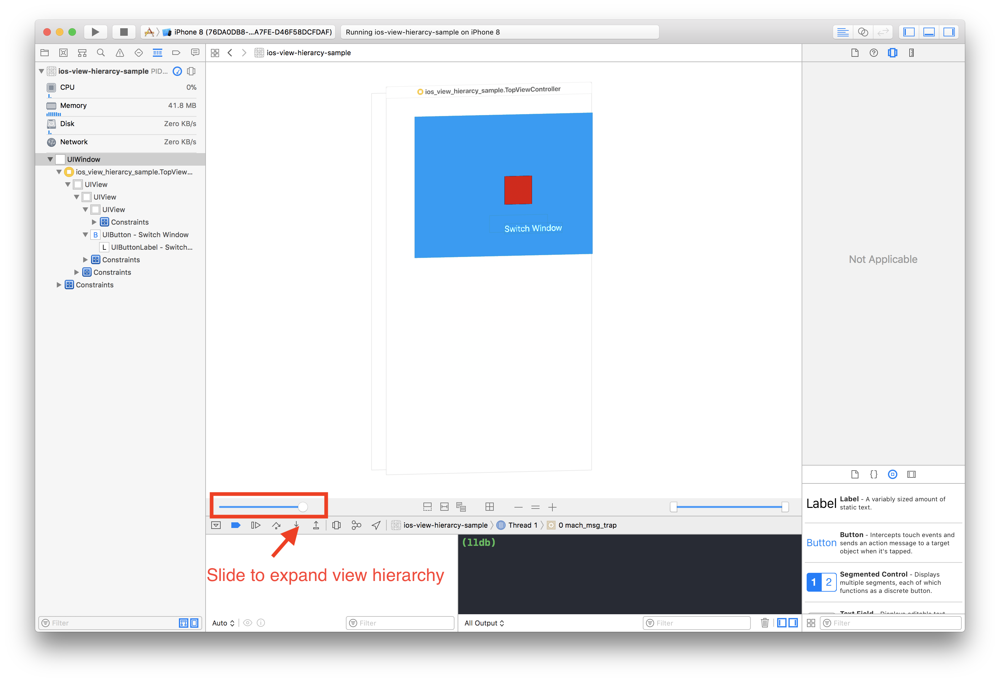

# View Hierarchy

## Topics

By the end of this lesson we will cover:
- the basics of UIViews
- CALayers
- Subviews and Superview
- UIViewControllers
- UIWindows

## UIViews

A view object marks a rectangular area on the screen can that control the drawing of objects. It is responsible for handling and responding to events such as touches and aids other sub components to draw onto a screen(eg iPhone).

Views by themselves aren't very useful, to make use of a UIView, it needs to be added onto a Window( Windows are covered below).

UIViews don't necessarily draw onto the screen but rather provide the infrastructure for drawing onto the screen. Think of UIViews as empty canvases that we can draw unto.

The UIKit framework provides us with some basic UIComponents made out of UIViews(subclasses). Controls like UIButton, UISegmentedControl eg all inherit from UIView and utilize this to draw themselves onto the screen and handle input from users such as tapping a UIButton.

### Superview & Subviews

UIKit uses a lot of Object Oriented Programming principles. Each UIView subclass can have one **superview** and many **subviews**.

The relationship between _superviews_ and _subviews_ are really important and come in handy when discussing the differences between a View's **frame** and its **bounds**.

### Interface Objects - XIBs, NIBs
Interface objects are used to represent visual and non-visual elements. They can represent views, windows, menus and controls but are also used to represent non-visual elements such as gesture recognizers.

#### File's Owner
The File's Owner object is unlike other interface objects. It serves as a link between your Interface Object and its connection in code. You can think of it as a controller for your interface object.

### Activity
#### Creating a Custom UIView with XIBs

Creating custom UIViews in Xcode isn't the most pleasant experience. Unlike creating custom UIViewControllers, custom UIViews don't automatically 'hook up' to their Xib files to their backing `.swift` files.

[Custom UIView with XIBs Starter Project]()

#### Guidelines for creating custom XIBs

- Break down user interfaces to modular XIBs
- Create custom XIB interfaces for frequently used custom components. eg. A custom UIButton

## CALayers

UIViews don't do much other than orchestrate and manage view hierarchy and respond to events. That is where CALayers come in.

Layers are responsible for drawing visual elements onto a view. Every UIView has at least one CALayer object that is backing it.

## UIViewController

## UIWindow
iOS applications start with a Window(UIWindow). It is a special subclass of UIView that is responsible for displaying & managing other view(UIViewControllers). The window can have many UIViews & UIViewControllers. Most apps typically have one Window.

### Activity

1. Download and open this sample project:

  [UIKit View Hierarchy Sample Project](https://github.com/Product-College-Labs/ios-view-hierarcy)

2. Click on the View Hierarchy inspector to view a breakdown of all the views in the app. It should look similar to the image below:

  

3. Slide the slider to expand the views:

  

#### Observation

1. What are some of the view layers you see?

2. What is the *type* of the first(base) view?

## Experiment
### Multiple windows in applications

An iOS application can have multiple windows but typically we will only have one.

There are some use cases for having multiple UIWindows in an iOS app. An example will be when you are trying to manipulate the status bar.

Windows are expected to have a root view controller, so when creating one we have to set that up.

### Window Levels

Windows also have hierarchy, we can set the level of each window to display one window above another:

There are three (3) window levels:

- UIWindowLevelNormal
- UIWindowLevelAlert
- UIWindowLevelStatusBar

Only one UIWindow can be _"key"_ at at time. This means that only one Window can be active at a time.

## Experiment
### Window Levels

Lets play with the window levels to see their effects.

## Activity

1. In pairs, discuss the hierarchy of display elements in iOS (views) and what they are responsible for.
