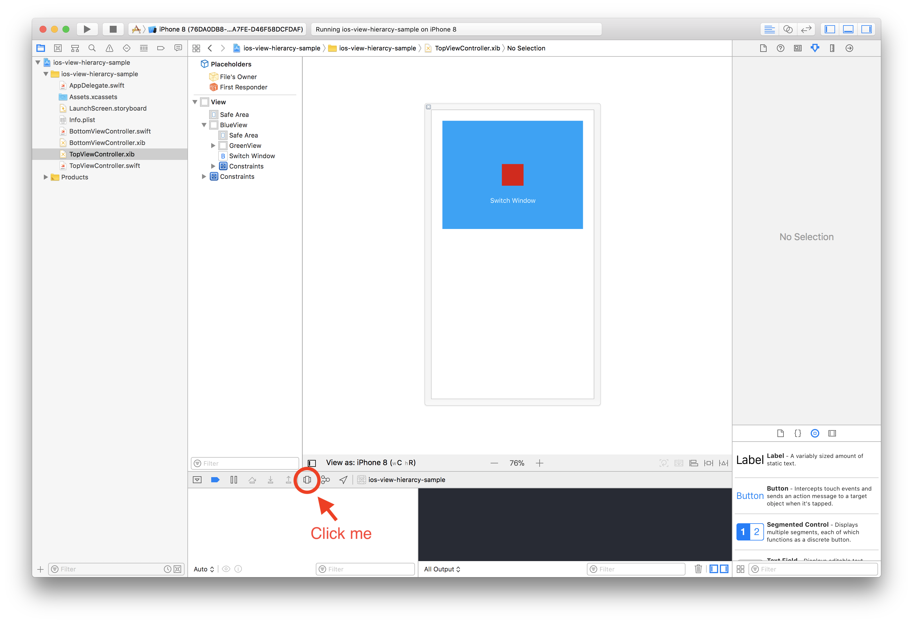

# View Hierarchy

The iOS view hierarchy starts with the Window(UIWindow). The window can have many UIViews, and every UIView can have many subviews. Most apps typically have one Window.

### Activity

1. Download and open this sample project:

  [UIKit View Hierarchy Sample Project](https://github.com/Product-College-Labs/ios-view-hierarcy)

2. Click on the View Hierarchy inspector to view a breakdown of all the views in the app. It should look similar to the image below:

  

3. Slide the slider to expand the views:

  

#### Observation

1. What are some of the view layers you see?

2. What is the *type* of the first(base) view?

## Experiment
### Multiple windows in applications

An iOS application can have multiple windows but typically we will only have one.

There are some use cases for having multiple UIWindows in an iOS app. An example will be when you are trying to manipulate the status bar.

Windows are expected to have a root view controller, so when creating one we have to set that up.

### Window Levels

Windows also have hierarchy, we can set the level of each window to display one window above another:

There are three (3) window levels:

- UIWindowLevelNormal
- UIWindowLevelAlert
- UIWindowLevelStatusBar

Only one UIWindow can be _"key"_ at at time. This means that only one Window can be active at a time.

## Experiment
### Window Levels

Lets play with the window levels to see their effects.
