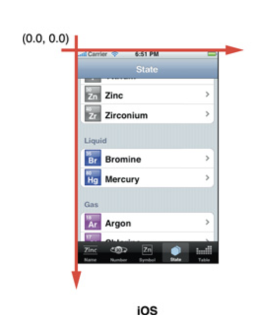
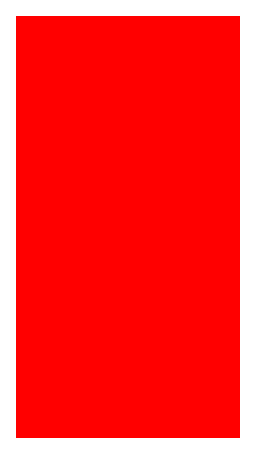
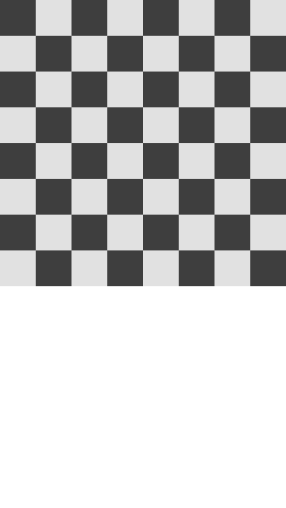
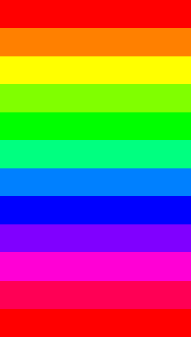
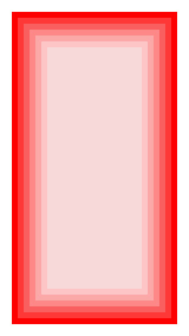
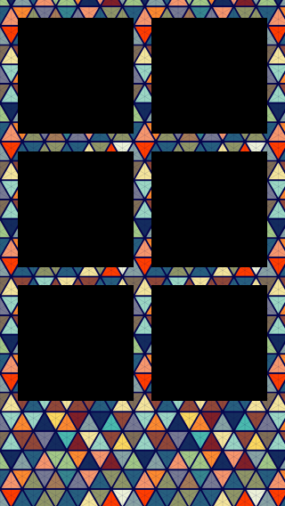

# Using Frame, Bounds, and Color

## Topics

By the end of this class, students will learn:
- The difference between frame & bounds
- How to position UI elements on screen using CoreGraphics primitives

## Vocabulary
- coordinate system
- frame
- bounds
- center
- anchor

## UIView Review

From the previous lesson we learnt that a view defines a rectangular area of a screen and what is drawn in that area. To size and position a rectangle on the screen you will need to use it's frame. When a view draws within it's own **coordinate
system** you'll use bounds. Often you'll want to fill a view with a color an image, or a pattern.

To do these things UIKit provides classes to help:

- CGSize
- CGPoint
- CGRect
- UIColor

The notes here talk about these classes.

## Frame, Bounds & Center

**CGSize**

A CGSize describes how wide and tall a view object should be.
It defines a width and a height and contains two properties:

- width: The Width.
- height: The height.

**CGPoint**

A CGPoint describes a point on the screen.
It defines two properties: x and y.

- x: The horizontal position.
- y: The vertical position.

**CGRect**

A CGRect contains four values that define a rectangle with a size and location.

- x: The horizontal position of the upper left corner.
- y: The vertical position of the upper left corner.
- width: The width.
- height: The height.

Using these four values the drawing system is able to place a rectangle of any size anywhere.

A CGRect can also be defined by a point and a size:

- origin: A CGPoint.
- size: A CGSize.

**Frame**

The position of Views and Layers is defined by their Frame. A frame defines a rectangle region of on
screen. A frame is made up of four features:

> Frame always works in the context of the of a view's super view.

**Bounds**

Bounds is a CGRect that defines the internal coordinates of a view or layer. At first frame and bounds
sound like the same thing, and they can have the same values at times, but they are different
conceptually. A frame defines a rectangle in relation to it's super view, while bounds defines a
rectangle in relation to itself. The values of a frame in it's super view's coordinate system.
Bounds defines a rectangle in a view's own coordinate system.

**Center**

Center is a CGPoint that sets the position of a view in it's super view around it's center point.

### Drawing in iOS

The drawing system in iOS starts from the upper left side of the screen.

<!--  -->
> Image courtesy of Apple

### CGFloat

Essentially a Double/Float. It holds a 32 or 64 bit value depending on the
system. Imagine it as a number that is optimized for use in Core Graphics
operations.

Anything working with graphics on the screen will probably use a CGFloat.

- Position
- Size
- Color

### CGPoint

A CGPoint represents two values that map to a coordinate on the screen. CGPoint
has two properties:

- x
- y

https://developer.apple.com/reference/coregraphics/cgpoint

### CGSize

A Struct representing the size of a rectangle. It has two properties.

- width
- height

https://developer.apple.com/reference/coregraphics/cgsize

### CGRect

A CGRect represents 4 values that represent the position and size of a rectangle
on the screen.

- x
- y
- width
- height

Besides these properties a CGRect also has:

- origin: A CGPoint containing x and y
- size: A CGSize containing width and height

But wait there's more!

- minX: The smallest value for the x-coordinate of the rectangle. Imagine this
as the position of the left edge.
- minY: The smallest value for the y-coordinate of the rectangle. Imagine this
as the position of the top edge.
- maxX: The largest value for the x-coordinate of the rectangle. Imagine this
to be the position of the right edge.
- maxY: The largest value of of the y-coordinate of the rectangle. Think of
this as the position of the bottom edge.
- midX: The half way point between, or center, between the left and right edges.
- midY: The mid point between the top and bottom edges.

Besides these properties CGRect has many methods that return a CGRect's
modified in one way or another.

- insetBy: Returns a rect inset by an amount. Imagine drawing a rectangle inside
the current rectangle.
- offsetBy: returns a rect offset, moved, some amount on the x and y.
- union: Returns the smallest rectangle that contains both rects. Imagine
drawing a box around two boxes that just fits them both.
- intersection: Returns a rectangle that represents the intersection of two
rectangles. Imagine the box where two rectangles overlap.

And more...

Besides these methods there are methods to determine if a point or rect is
contained in a rect.

These tools are there for you modify rectangles. You'll use these to determine
where a UIView is on the screen, move of size views, modify views to fit an area
and more.

https://developer.apple.com/reference/coregraphics/cgrect

## Using Initializers

Swift supports multiple initializers.

A subclass must call the default initializer in it's super class.

Use initializers to simplify your work and make your subclasses more flexible.

## UIColor

UIColor is a class that represents color. Color is made up of several components and can be expressed
with several different models on the computer. Two common models are RGBA and HSBA.

**RGBA**

UIColor is the default class that represents color. In computers colors can be represented in several
ways. Most common is RGBA this breaks color into three color components (Red, Green, and Blue) and a
transparency (Alpha).

Here are some common colors expressed in RGB:

- Red:
    - R: 255, G: 0, B: 0
- Yellow:
    - R: 255, G: 255, B: 0
- Orange:
    - R: 245, G: 165, B: 35

**HSBA**

Colors can also be represented as Hue, Saturation, Value, and Alpha.

- Hue: Is the color red, through, orange, yellow etc.
- Saturation: Is how much color, the more gray a color looks the less saturated it is.
- Value: Is the range from black to white, any color with a saturation of 0 is black.
- Alpha: Is the transparency of a color.

Why use RGB or HSB? RGB is a very common model you'll find many applications use this model and
supply values in RGB. On the other hand it can be hard to express colors without some help to
generate the correct Red, Green, and Blue values. HSB on the other hand expresses colors more
clearly in some cases. Making a rainbow of colors in RGB can be difficult to calculate, using HSB
makes this task much easier.

`let c = UIColor(red: 1, green: 0, blue: 0, alpha: 1)`

This would be red. Often RGBA colors are expressed with components in the range of 0 to 255.
Photoshop and Sketch will show values in this range. UIColor expects values in the range of 0 to 1.
The color c in the example above would be red. You can convert values in the 255 range by writing
then like this:

`let c = UIColor(red: 255/255, green: 0/255, blue: 0/255, alpha: 1)`

- [https://en.wikipedia.org/wiki/RGB_color_model](https://en.wikipedia.org/wiki/RGB_color_model)

UIColor's various initializers

- Initialize UIColor with RGB values:
    - `UIColor(red: 1, green: 0, blue: 0, alpha: 1)`
- Initialize UIColor with HSB values:
- `UIColor(hue: 0.83, saturation: 0.6, brightness: 0.87, alpha: 1)`
- Initialize UIColor with a gray scale value from black to white.
    - `UIColor(white: 0.5, alpha: 1) // 50% gray`

You can also initialize UIColor with a pattern image. Used as the background color for a view fills
that view with image tiled.

- `UIColor(patternImage: UIImage(named: "pattern")!)`

## Challenges

Here are a few exercises to test out your knowledge of the material here:

- Make a view that fills the screen with a 20 pixel margin.
    - 
- Make an 8 by 8 grid that fills the screen. Color every other square black and white. Like a chess board.
    - 
- Make rainbow of views, rectangles stacked vertically.
    - 
- Make concentric squares where the saturation changes from 1 to 0 for a single color.
    - 
- Recreate the example.
    - 
