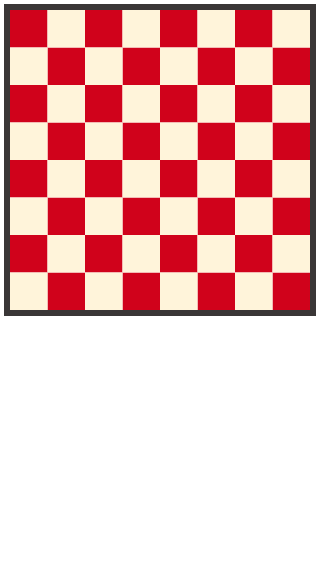
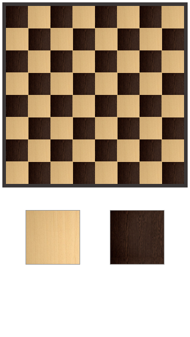
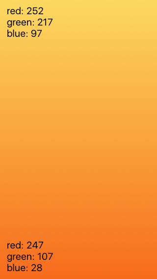
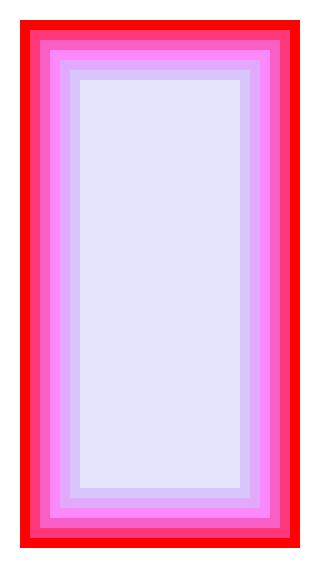
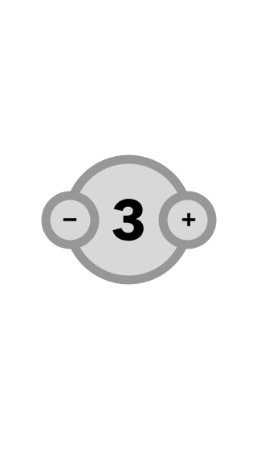
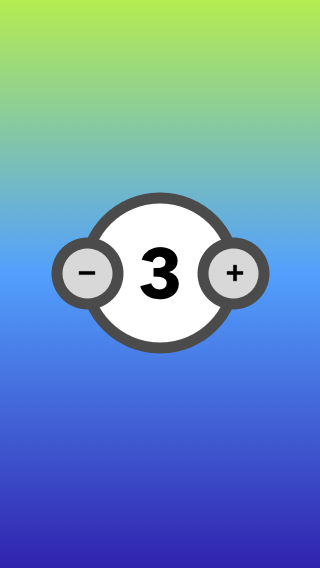
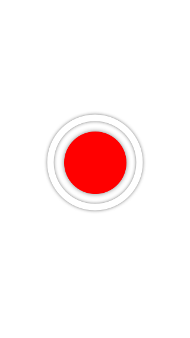

# Layers

As we have learned in the previous lessons a UIView draw itself to the screen. This is only half 
the story. Every UIView has a layer property which is type CALayer. **A UIView doesn't actually 
draw iteself to the screen, it draws itself into it's layer.** It's the layer that really 
represents the pixels that we see on the screen. Every view has one layer but, Layers can have 
any number subLayers.

> Any view you create can be made up of multiple layers on which is drawn various pieces of the element. 
> All of the built in UI widgets (UILabel, UIButton, UISwitch etc.) are created this way!

While this might sounds more complicated. Layers can make drawing easier by allowing you to place 
of the View drawing on different layers. Layers can be animated. 

You can think of layers like views within a view. You can size and draw them very similarly to the 
way you create and drew UIViews in the previous example. 

## Layers properties 

Layers have properties that similar to UIView, and a few more! Here are a few notable properties: 

- frame
- bounds
- position
- zPosition
- anchorPoint
- contentScale
- transform
- borderWidth
- borderColor
- cornerRadius

A big advantage to using layers is that now that you have created a custom view with layers you 
can size, position, and transform the View and all of the layers draw themselves within the view.

Spend a few minutes reading the Apple docs for CALayer

- https://developer.apple.com/reference/quartzcore/calayer

CALayer also has a few specialized subclasses. 

### CAGradientLayer 

CAGradientLayer is a subclass of CALayer that is specialized to draw a gradient with it's area. 
Anytime you want a gradient this is probably your best choice. 

Take a few minutes to read the Apple docs:

- https://developer.apple.com/reference/quartzcore/cagradientlayer

### CATextLayer 

CATextLayer is used to draw a layer that contains text. Use this to add text to a UI element or 
custom control. This is probably at the heart of UILabel, and UITextField. If you are making your
own control with text you might compose your control with a Text Layer if you text needs are simple
or require close control over how text is drawn. Alternatively you might add a UILayer or UITextField 
as a sub view. 

Take a minute to read what Apple has to say about CATextLayer. 

- https://developer.apple.com/reference/quartzcore/catextlayer

## Challenges 

Use the ideas from the last lesson to build some views that are made of layers. 

- Create chessboard with an outer border. 
    - 
- Create chessboard with image pattern fill. 
    - 
- Create a layer with a gradient  
    - 
- Concentric rectangles change the hue and saturation. 
    - 
- Imagine this as a UI element that let's us select a number. Note: Probably best to use UILabel for
    the text elements.
    - 
- Add a gradient background. 
    - 
- Make a couple circle and add a shadow.
    - 

## More information

- https://www.raywenderlich.com/90488/calayer-in-ios-with-swift-10-examples

